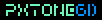

# PxtoneGD

### Pxtone playback for [Godot Engine.](https://godotengine.org/ "Godot Engine.")
<div align="center">  </div>

## What is Pxtone?

Pxtone is a lightweight music format developed by [Studio Pixel,](https://studiopixel.jp/ "Studio Pixel,") known for games such as [Cave Story](https://www.cavestory.org/ "Cave Story") and [Kero Blaster.](https://store.steampowered.com/app/292500/Kero_Blaster/ "Kero Blaster.")
You can use [pxtone Collage](https://pxtone.org/downloads/ "pxtone Collage") to make pxtone music files, but other alternatives such as the cross-platform [pxtone Collab](https://yuxshao.github.io/ptcollab/ "pxtone Collab") also exist.

## Usage

To use this module, simply clone the repository inside of the `modules` subfolder:

```
cd godot/modules
git clone https://github.com/EnthWyrr/PxtoneGD.git pxtone
```

And then compile the engine.

## Tested platforms

Although it should work on any of the platforms that Godot supports, only Windows, Linux and Android have been tested.
